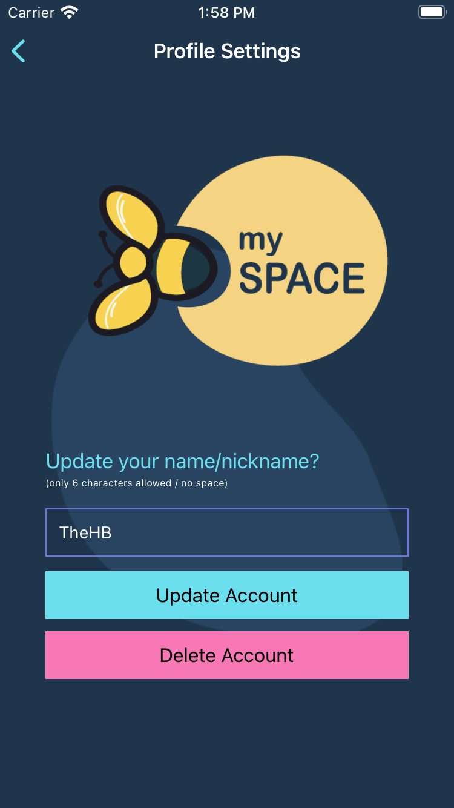
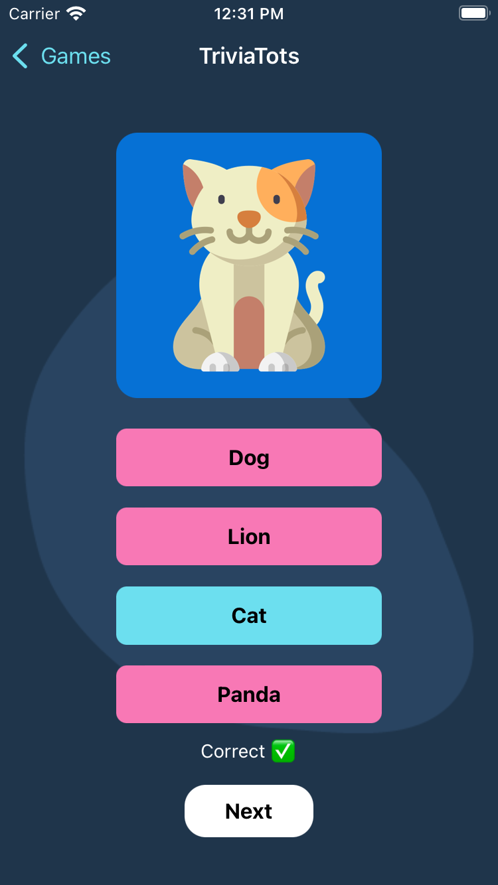

 

<h1 align="center">ReadAroo - Happy PlayLearning!   (IOS and Android Application)</h1>

## 👨‍💻 Demo

 
<table>
  <tr>
    <td valign="top"></td>
    <td valign="top"></td>
    <td valign="top"></td>
    <td valign="top"></td>
    <td valign="top"></td>
    <td valign="top"></td>
    </tr>
    <tr>
    <td valign="top"></td>
    <td valign="top"></td>
    <td valign="top"></td>
    <td valign="top"></td>
    <td valign="top"></td>
    <td valign="top"></td>
    </tr>
    <tr>
    <td valign="top"></td>
    <td valign="top"></td>
    <td valign="top"></td>
    <td valign="top"></td>
    <td valign="top"></td>
    <td valign="top"></td>
    </tr>
  <tr>
    <td valign="top"></td>
    <td valign="top"></td>
    <td valign="top"></td>
    <td valign="top"></td>
    <td valign="top"></td>
    <td valign="top"></td>
  </tr>
  <tr>
    <td valign="top"></td>
    <td valign="top"></td>
    <td valign="top"></td>
    <td valign="top"></td>
    <td valign="top"></td>
    <td valign="top"></td>
  </tr>
</table>

Check out the live app on Google Play Store & Apple App Store: [readaroo](https://play.google.com/store/apps/details?id=com.readaroo)

## 📱 Tech used

                 

## 🗣️ About this project

ReadAroo- The most fun way to learn to read! Helping parents and kids with their reading journey. 
Readaroo is an engaging phonics and alphabet teaching app designed to make learning fun for children, from toddlers all the way to preschoolers and kindergartners. This free app offers a variety of interactive games to help kids recognize letter shapes, associate them with phonic sounds, and put their alphabet knowledge to use in fun interactive exercises.  The app includes colorful visuals, audio cues and interactive games to make learning enjoyable and effective. Engage your child with bite-sized lessons teaching the alphabet, phonics, vocabulary, and more. And give your child the smart start of learning the sounds of the letters! Happy PlayLearning!

- Alphabet Flash Cards - a list of sounds to listen to ✅
- 6 mini-game boards - interactive games tailored for young learners/minds ✅
- Easy and intuitive: Toddlers can play this game independently ✅
- No stress or time limits ✅
- Safe environment for your kids (girls & boys). Ads free and No pop ups ✅
- Stretch goal - login and track progress ▢ 🟥

## ツ Show your support
Give a ⭐️ if this project helps you or you like it.